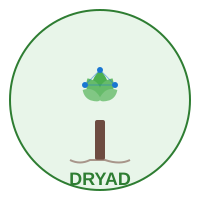

<div align="center">
  

# Project Dryad

**Smart Plant Health Monitoring System**

[](https://github.com/YOUR_USERNAME/dryad/actions/workflows/build.yml)
[](https://opensource.org/licenses/MIT)
[](https://github.com/espressif/esp-idf)

</div>

## 🌱 Overview

Project Dryad is an IoT plant monitoring system that keeps your plants healthy by tracking soil moisture and environmental conditions. Built on ESP32-C6/C3 microcontrollers, it sends real-time alerts via MQTT and email when your plants need attention.

## ✨ Features

- 📊 **Real-time Monitoring** - Soil moisture, temperature, humidity, and light sensing
- 📡 **MQTT Communication** - Remote monitoring with efficient data transmission
- 📧 **Email Alerts** - Automatic notifications when plants need water
- 🔋 **Battery Powered** - Extended operation with low-power design
- 💡 **Status LEDs** - Visual indicators for offline monitoring
- 🖥️ **Display Support** - I2C circular display (240x198) for local readings

## 🛠️ Hardware Requirements

| Component | Description | GPIO |
|-----------|-------------|------|
| ESP32-C6/C3 | Main controller with WiFi 6 support | - |
| Moisture Sensor | Capacitive soil moisture sensor | GPIO0 (ADC1_CH0) |
| Display | [MSP0963 ST7789](https://2btrading.tn/accueil/9488-module-d-affichage-circulaire-096-240x198-msp0963-st7789-pour-raspberry-stm32-.html) | I2C pins |
| Environmental Sensors | Temperature, humidity, light | Various |
| Status LEDs | System status indicators | Configurable |

## 📦 Quick Start

### Prerequisites
- [ESP-IDF v5.5](https://docs.espressif.com/projects/esp-idf/en/latest/esp32/get-started/)
- Python 3.8+
- Git

### Installation

```bash
# Clone repository
git clone https://github.com/YOUR_USERNAME/dryad.git
cd dryad

# Setup ESP-IDF environment
source $IDF_PATH/export.sh  # Linux/macOS
# or
$IDF_PATH/export.bat        # Windows

# Configure target
idf.py set-target esp32c6   # or esp32c3

# Build and flash
./build.sh                  # Uses included build script
# or
idf.py build flash monitor  # Direct ESP-IDF commands
```

## 🏗️ Project Structure

```
dryad/
├── main/                   # Application source code
│   ├── main.c             # Entry point
│   ├── moisture_sensor.*  # Sensor implementation
│   └── display.*          # Display driver
├── .github/workflows/     # CI/CD automation
├── partitions.csv         # Custom partition table (OTA support)
├── sdkconfig.defaults     # Default configuration
└── build.sh              # Build helper script
```

## 🔧 Configuration

Configure WiFi and MQTT settings:
```bash
idf.py menuconfig
```

Key settings:
- **WiFi credentials** - Network connection
- **MQTT broker** - Remote monitoring endpoint
- **Sensor calibration** - Adjust DRY_VALUE and WET_VALUE for your sensor

## 🚀 CI/CD

GitHub Actions automatically builds firmware for both ESP32-C6 and ESP32-C3 using ESP-IDF v5.5 on every push to `main` or `dev` branches. Build artifacts are available in the Actions tab.

## 📤 Flashing Firmware

```bash
# Using idf.py (recommended)
idf.py -p /dev/ttyUSB0 flash

# Using esptool.py
esptool.py -p /dev/ttyUSB0 -b 460800 write_flash \
  0x0 build/bootloader/bootloader.bin \
  0x8000 build/partition_table/partition-table.bin \
  0x10000 build/dryad.bin
```

## 🐛 Troubleshooting

| Issue | Solution |
|-------|----------|
| Build fails | Ensure ESP-IDF is sourced: `source $IDF_PATH/export.sh` |
| Flash fails | Check port permissions: `sudo chmod 666 /dev/ttyUSB0` |
| Wrong readings | Calibrate sensor values in `moisture_sensor.c` |
| Monitor stuck | Exit with `Ctrl+]` |

## 🤝 Contributing

Contributions are welcome! Please feel free to submit a Pull Request.

## 📄 License

This project is licensed under the MIT License - see the [LICENSE](LICENSE) file for details.

## 🙏 Acknowledgments

- ESP-IDF team for the excellent framework
- Community contributors

---

<div align="center">
Made with 💚 for plant lovers
</div>